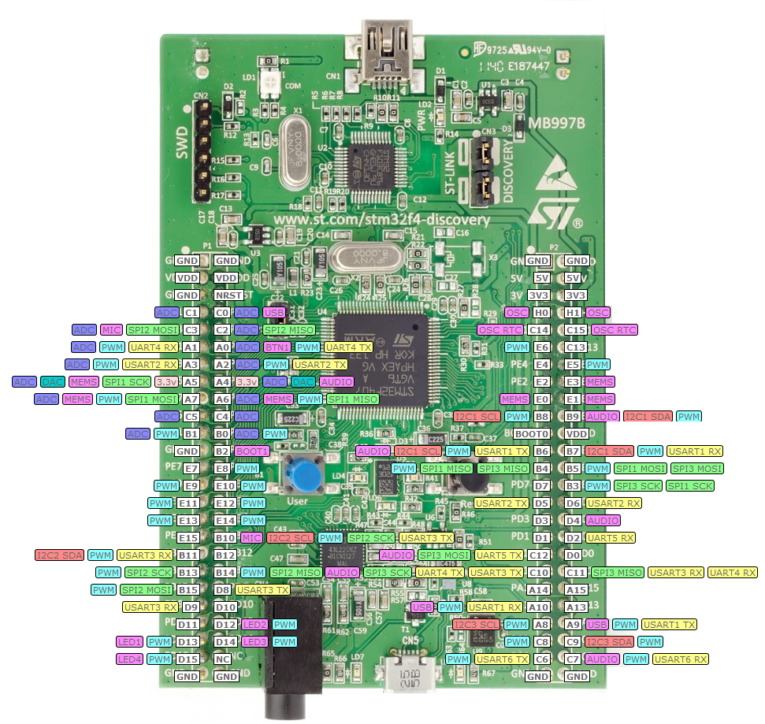

# Microcontroller-Driver-Development-SPI-I2C-USART-RTC-GPIOs-

An integral skill that embedded software developers need to master is understanding how to write drivers comprehensively.
Inside of an embedded system, two types of drivers exist: MCU peripheral drivers and external driver devices which are connected through MCU peripherals such as SPI, I2C, or USART. 
In today's world, although, microcontroller manufacturers provide fundamental drivers for their products, when it comes to speciality drivers must be modified.
Hence, embedded software developers or software architects are responsible for writing their own libraries in most of the cases.

STM32F407VG ARM CORTEX-M4 Discovery Board Specific header and driver codes.

Serial Peripheral Interface (SPI)
Inter-integreated Circuit (I2C)
General Purpose Input / Output (GPIO)
Univeral Asynchronous/Synchronous Receive & Transmit (USART)
Real-Time-Clock (RTC)

